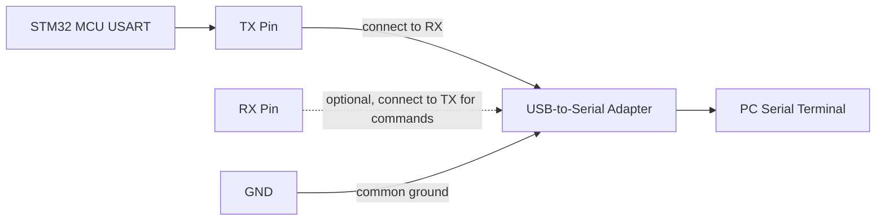

# STM32 UART Logger

Reusable blocking UART logger library for STM32CubeIDE projects. It works with STM32 HAL based projects across STM32 series because the application passes the `UART_HandleTypeDef` during initialization.

## Features

- Supports STM32 HAL UART handles from any STM32 family.
- Provides `ERROR`, `WARN`, `INFO`, and `DEBUG` log levels.
- Supports runtime log filtering and compile-time macro filtering.
- Optional `[123 ms]` timestamp prefix using `HAL_GetTick()`.
- Optional `[INF]`, `[DBG]`, `[WRN]`, `[ERR]` level prefix.
- Raw byte, string, line, and formatted log APIs.
- No dynamic memory allocation.

## Files

```text
drivers/uart_logger/
  Inc/
    stm32_uart_logger.h
  Src/
    stm32_uart_logger.c
  README.md
```

## Hardware Connection

Use any STM32 USART/UART configured by CubeMX. For a PC serial terminal, connect the STM32 board to a USB-to-serial adapter.



## CubeMX Configuration

1. Enable one USART/UART peripheral, for example `USART2`.
2. Set mode to `Asynchronous`.
3. Use standard terminal settings, for example `115200`, `8 bits`, `No parity`, `1 stop bit`.
4. Generate code with STM32CubeIDE.
5. Confirm CubeMX generated the UART handle, for example `UART_HandleTypeDef huart2;`.

## Add To STM32CubeIDE Project

1. Copy `drivers/uart_logger/Inc/stm32_uart_logger.h` into your project driver include folder.
2. Copy `drivers/uart_logger/Src/stm32_uart_logger.c` into your project driver source folder.
3. Add the include path for the logger `Inc` folder in project settings.
4. Include `stm32_uart_logger.h` in `main.c` or your application module.
5. Initialize the logger after `MX_USARTx_UART_Init()`.

## Basic Example

```c
#include "main.h"
#include "usart.h"
#include "stm32_uart_logger.h"

static STM32_UART_Logger_Handle_t debugLogger;

void App_Init(void)
{
    STM32_UART_Logger_Config_t loggerConfig = {
        .huart = &huart2,
        .txTimeoutMs = 100U,
        .minimumLevel = STM32_UART_LOGGER_LEVEL_DEBUG,
        .enableTimestamp = 1U,
        .enableLevelPrefix = 1U,
        .lineEnding = "\r\n"
    };

    (void)STM32_UART_Logger_Init(&debugLogger, &loggerConfig);

    STM32_LOG_INFO(&debugLogger, "Application started");
    STM32_LOG_DEBUG(&debugLogger, "SystemCoreClock: %lu Hz", (unsigned long)SystemCoreClock);
}
```

## Example Output

```text
[15 ms] [INF] Application started
[16 ms] [DBG] SystemCoreClock: 64000000 Hz
```

## API

| Function | Purpose |
| --- | --- |
| `STM32_UART_Logger_Init` | Initializes the logger with an application UART handle. |
| `STM32_UART_Logger_DeInit` | Clears the logger handle. |
| `STM32_UART_Logger_SetLevel` | Changes the runtime minimum log level. |
| `STM32_UART_Logger_Write` | Sends raw bytes. |
| `STM32_UART_Logger_WriteString` | Sends a null-terminated string. |
| `STM32_UART_Logger_WriteLine` | Sends a string with the configured line ending. |
| `STM32_UART_Logger_Log` | Sends a formatted log line. |
| `STM32_UART_Logger_IsInitialized` | Checks the logger initialization state. |

## Convenience Macros

```c
STM32_LOG_ERROR(&debugLogger, "Sensor error: %d", errorCode);
STM32_LOG_WARN(&debugLogger, "Battery low");
STM32_LOG_INFO(&debugLogger, "Network ready");
STM32_LOG_DEBUG(&debugLogger, "ADC raw: %u", adcValue);
```

## Compile-Time Log Level

By default, all log macros are enabled. To remove lower priority logs at compile time, define `STM32_UART_LOGGER_COMPILE_LEVEL`.

Example for only error and warning logs:

```c
#define STM32_UART_LOGGER_COMPILE_LEVEL STM32_UART_LOGGER_LEVEL_VALUE_WARN
#include "stm32_uart_logger.h"
```

## HAL Include Override

The logger includes `main.h` by default because STM32CubeIDE projects usually include the correct HAL family header from there. If your project needs a direct HAL include, define `STM32_UART_LOGGER_HAL_INCLUDE` before including the logger.

```c
#define STM32_UART_LOGGER_HAL_INCLUDE "stm32g0xx_hal.h"
#include "stm32_uart_logger.h"
```

## Custom Timestamp Source

The default timestamp uses `HAL_GetTick()`. Override this weak function if your application has a different time base.

```c
uint32_t STM32_UART_Logger_GetTick(void)
{
    return My_Rtos_GetTickMs();
}
```

## Notes

- This logger uses blocking `HAL_UART_Transmit()` for maximum portability.
- For high-speed production logging, keep messages short or send logs from a low-priority task.
- Do not call formatted logging from timing-critical ISRs.

@copyright : Satish Kanawade. All rights reserved.
