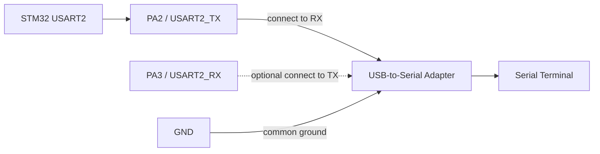

# UART Logger Basic Example

This folder gives one clear CubeIDE-style example showing how to use the `drivers/uart_logger` library in an STM32CubeIDE project.

## Example Files

| File | Purpose |
| --- | --- |
| `main.c` | Reference `main.c` showing exactly where logger initialization and log calls go. |

Keep your CubeMX generated `SystemClock_Config`, GPIO initialization, and UART initialization for your selected STM32 board.

## Driver Files To Add

Copy these two library files into your STM32CubeIDE project:

```text
drivers/uart_logger/Inc/stm32_uart_logger.h
drivers/uart_logger/Src/stm32_uart_logger.c
```

Then add the logger `Inc` folder to the CubeIDE include path.

## CubeMX Setup

1. Enable one UART, for example `USART2`.
2. Configure it as `Asynchronous`.
3. Set baud rate to `115200`.
4. Keep format as `8 data bits`, `No parity`, `1 stop bit`.
5. Generate code.

## Wiring



## How To Use

1. Open your CubeIDE generated `main.c`.
2. Add this include:

```c
#include "stm32_uart_logger.h"
```

3. Add the logger handle globally:

```c
static STM32_UART_Logger_Handle_t debugLogger;
```

4. Initialize logger after `MX_USART2_UART_Init()`:

```c
STM32_UART_Logger_Config_t loggerConfig = {
    .huart = &huart2,
    .txTimeoutMs = 100U,
    .minimumLevel = STM32_UART_LOGGER_LEVEL_DEBUG,
    .enableTimestamp = 1U,
    .enableLevelPrefix = 1U,
    .lineEnding = "\r\n"
};

(void)STM32_UART_Logger_Init(&debugLogger, &loggerConfig);
```

5. Use log macros anywhere after initialization:

```c
STM32_LOG_INFO(&debugLogger, "System started");
STM32_LOG_DEBUG(&debugLogger, "Tick: %lu ms", (unsigned long)HAL_GetTick());
STM32_LOG_WARN(&debugLogger, "Low voltage warning");
STM32_LOG_ERROR(&debugLogger, "Sensor failed");
```

## Expected Serial Output

```text
[24 ms] [INF] UART logger example started
[25 ms] [INF] Library version: 1.0.0
[26 ms] [DBG] Build: May 20 2026 10:19:00
[1027 ms] [INF] Heartbeat: 1, Tick: 1027 ms
```

## Change UART

If your project uses another UART, only change the handle:

```c
.huart = &huart1
```

or

```c
.huart = &huart3
```

@copyright : Satish Kanawade. All rights reserved.
